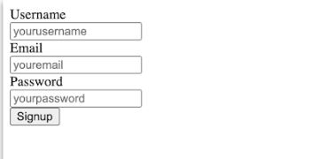
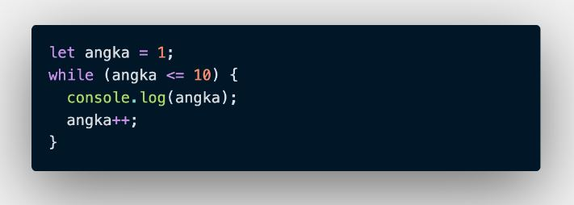

# WRITING AND PRESENTATION TEST WEEK 1

## Day 1
### Unix Command Line

Sebelumnya aplikasi berdasarkan tampilan ada 2 yaitu:
1. GUI (Graphic User Interface), Berisi tampilan.
2. CLI (Command Line Interface), Berisi teks.

* Didalam command Line ada apliaksi yaitu shell, Shell adalah perintah-perintah untuk menginstruksikan sistem operasi.
* Command Line interface jenis shell yang berbasis teks.
* Terminal Emulator, aplikasi untuk mengakses CLI.
* shell yang digunakan kali ini adalah bash. untuk membuka pilih search kemudian ketik git bash. berikut tampilan gitbash :


* File system mengatur data disimpan di dalam sebuah system.

**Perintah-Perintah Dasar Terminal**
- pwd (print working shell), untuk melihat current working direktori atau lokasi.
   
   

- ls (list), untuk melihat isi file yang ada dari direktori.

   

- cd (change direktori), untuk berpindah direktori. **(direktori = folder)** 

   

- cat, untuk menampilkan isi dari file (Seluruh isi yang ada),
- head, untuk menampilkan isi dari bagian atas file.
- tail, untuk menampilkan isi dari sebuah file dari bagian bawah.

    

- mkdir, untuk membuat direktori baru.

   

- touch, untuk membuat file baru.

   

- cp, untuk menyalin file. cara penulisan yaitu : cp fileDicopy filebaru(dalam 1 folder) 


    cp fileDicopy /e/filebaru(beda direktori)).


- cp-R, untuk menyalin direktori.


- mv (move), untuk memindahkan file (penggunaan nya: mv namaFile /e/FileBaru).


    selain itu digunakan untuk mengubah nama folder (penggunaannya: mv namaFile NamaFileBaru)


- mv-R, untuk memindahkan direktori.


- rm (remove), untuk menghapus file secara permanen.


- rm-R atau rm-d untuk menghapus direktori.


### Git & Github

* Git biasanya digunakan sebagai tempat penyimpanan file pemrograman karena lebih efektif. Selain itu file yang disimpan menggunakan git akan teracak seluruh perubahannya, termasuk siapa yang mengubah.
* Git dan Github merupakan tools yang wajib digunakan agar bisa berkolaborasi mengerjakan proyek yang sama tanpa harus copy paste folder aplikasi terupdate. Selain itu setiap orang tidak perlu menunggu tim lain menyelesaikan program terlebih dahulu untuk berkolaborasi.
* Git adalah (software) alat untuk membuat version control system (save data, kembali ke data sebelumnya atau sesudahnya). sedangkan Github adalah platform untuk mengupload codingan. jadi, Git dan Github berbeda namun berhubungan.
* pilih folder yang akan digunakan, klik kanan pilih gitbash. kemudian tuliskan **git init** , dengan ini akan dibuatkan local repo di folder yang sama bernama **.git**.
* ketik **git add .** digunakan untuk menyimpan file di direktori dan bersifat sementara.


* ketik **git status** untuk melihat apa ada perubahan atau tidak.
* ketik **git commit -m** digunakan untuk menyimpan perubahan secara permanen. 


* Buat repository baru di akun github.
* salin git remote ke terminal dan jalankan.
* ketik git push -u origin main.


* untuk melakukan cloning pilih code kemudian salin link, ketik git clone tempel link.

## Day 2
### HTML

* HTML (Hypertext Markup Language) digunakan untuk menampilkan konten pada browser.
* Konten yang dapat ditampilkan seperti text, Image, Video, Link dan Masih Banyak lainnya.
* HTML bersifat statis, hanya bertugas menampilkan konten yang diminta developer.
* Tool utama yang harus dipersiapkan untuk membuat HTML yaitu Browser dan Code editor. Untuk hal ini kita menggunakan chrome untuk browser dan vs code untuk code editor.
* Berikut contoh HTML sederhana :


* Dengan output sebagai berikut :


* Menjalankan HTML secara manual dengan cara klik dua kali pada nama file html (Dimana file html itu disimpan) kemudian akan muncul tampilan html di browser.
* Menjalankan HTML secara Live Server yang ada di vs code 
1. **Instal terlebih dahulu di vs code dengan cara :**
    - pilih menu extension sebelah kiri
    - ketik live server
    - klik instal live server
2. Pilih explorer
3. Klik kanan pada file html yang akan di tampilkan
4. Pilih open with live servers
5. Akan muncul browser kemudian akan tampil file html yang sudah dibuat sebelumnya, setiap perubahan browser akan menampilkan perubahan tanpa melakukan refresh pada browser.

**Tag popular yang digunakan dalam HTML**
- ``, syntax nya : 
    * ``, src digunakan untuk nama file yang akan ditampilkan, alt digunakan untuk alternatif jika gambar rusak maka akan menampilkan kata dalam alt. ( ini jika file gambar pada lokal komputer ). 
    * ``, sama seperti diatas namun source menggunakan link dari internet.
- `<video>`, Syntax nya :
    * ```<video controls> 
            <source src="filevideo.mp4" type="video/mp4">
        </video>```
        * controls digunakan untuk mengatur videonya di play atau pause dan indikator menit.
- `<table>`, Syntax nya :

    

    * Output yang dihasilkan sebagai berikut :

    

- `<form>`, Syntax nya :

    

    * Output yang dihasilkan sebagai berikut :

    

**Semantic HTML** digunakan untuk memudahkan programmer membaca kode. contoh semantic berupa :
- `<section>`, menandakan bagian dalam dari sebuah halaman web.
- `<header>`, merupakan bagian tajuk dari sebuah halaman web.
- `<footer>`, merupakan bagian halaman web yang terletak dibawah konten utama.
- `<article>`, menandakan bagian sebuah block teks yang isinya independen terhadap element lain dalam halaman web.
- `<nav>`, bagian yang berisi tautan navigation utama.
- `<aside>`, bagian samping dari konten utama.

* Cara mempublish website :
    - Buat akun netlify dengan akun github
    - pilih add new site, kemudian import an existing project
    - akan muncul tampilan seperti dibawah ini :

        

    - pilih github sehingga menampilkan :

        

    - kemudian pilih Autorize Netlify, akan tampil :

        

    - pilih repositori github yang akan dipublish, akan tampil :

        

    - Kemudian klik deploy site, sehingga akan dipublish dan kita mendapatkan alamat untuk diakses diinternet.

        

    

## Day 3
### CSS

* CSS digunakan untuk menambah desaign untuk halaman web.
* Cara menyispkan file css ada 3 cara yaitu :
    - inline, menyisipkan kode css langsung didalam HTML element. exemple : `<h1 style:"color: red;">`
    - internal, menggunakan element `<element>` untuk menyisipkan kode css dimasukkan kedalam element. exemple : 
    ```
    <style>
    h1{
       color : red;
    }
    </style>
    ```
    - eksternal, menyisipkan file dengan membuat file css terpisah, untuk menyambungkan file menggunakan element `<link>` dan diletakkan ke element `<head>`. exemple :
    ```
        <head>
            <link rel ="stylesheet" href ="style.css">
        </head>
    ```

* Sintaks terdiri dari selector, property dan value.
    ```
    p{
        color: blue;
    }
    ```
     
     - p diatas sebagai selector.
     - color sebagai property. 
     - blue sebagai value.

* contoh styling css pada halaman HTML


* output dibrowser seperti dibawah ini :


* Flexbox adalah cara untuk mengatur layout. flexbox direkomendasikan karena penggunaannya yang mudah dan didukung oleh kebanyakan browser.
* Flexbox memiliki kemampuan untuk menyesuaikan layout secara otomatis.
* Flexbox memiliki 1 parent/ contaier dan bisa beberapa child/item.

    

    

* contoh penerapan flexbox :
    - file HTML
    ```
    <div class="container"> (ini sebagai parent)
    <div class="item">item</div> (ini sebagai child)
    <div class="item">item</div>
    <div class="item">item</div>
    <div class="item">item</div>
    <div class="item">item</div>
    <div class="item">item</div>
    <div class="item">item</div>
    </div>
    ```
    - File css

    ```
    .container{
        display: flex;
        boder: 5px solid;
    }

    .item {
        border: 1px;
        width: 200px;
        height: 200px
        background-color: orange;
        }
    ```

- output :


* untuk properti dan value lainnya bisa cek didokumentasi pada link di bawah ini:

 https://yoksel.github.io/flex-cheatsheet/#flex-direction

* Flex-direction, properti flex-direction digunakan untuk mengatur letak item child.  ada 4 value flex-direction yang harus kamu ketahui:
1. row (default): secara default letak item child membentuk sebuah baris dari kiri ke kanan.
2. row-reverse: letak item child membentuk sebuah baris dari kanan ke kiri
3. column: letak item child membentuk sebuah baris dari atas ke bawah
4. column-reverse: letak item child membentuk sebuah baris dari bawah ke atas


* flex-wrap
    - lex secara default akan membuat tata letak item children dalam 1 line saja. flex akan menyesuaikan space yang ada.
    - namun jika kamu ingin membatasi jumlah item children dalam 1 line lalu item children yang lain akan pindah ke posisi line yang baru, maka kita bisa menggunakan flex-wrap.
    - properti flex-wrap memiliki 3 value:
        - no-wrap (default): secara default , flex tidak menggunakan flex-wrap
        - wrap: flex item akan memiliki beberapa line dari atas ke bawah  jika space dalam 1 line sudah full width.
        - wrap-reverse: kebalikan dari wrap yaitu lex item akan memiliki beberapa line dari bawah ke atas  jika space dalam 1 line sudah full width

        

* flex-flow
    - properti flex-flow digunakan sebagai shortcut untuk set up flex-direction dan flex-wrap bersamaan.
    - ada 4 value pada flex-flow:
        1. row nowrap
        2. column wrap
        3. column reverse
        4. row-reverse wrap-reverse


## Day 4
### Algoritma

* Algoritma adalah proses dilakukan dengan cara yang logis (masuk akal) dan sistematis (terurut).
* Data struktur adalah cara penyimpanan pengorganisasian dan pengaturan data di dalam media penyimpanan komputer sehingga data dapat digunanakan secara efisien.
* Manfaat algoritma dan data struktur yaitu Dengan Data struktur yang baik maka konsep algoritma yang dgunakan pu akan baik begitujuga sebaliknya.
* Algoritma sederhana dengan bahasa pemrograman javascript :
```
var a,b,c;
a = prompt("First Number?");
b = prompt("Second Number?");
c = Number (a) + Number (b);
console.log(c);
alert("Result = " + c);
```

### Intro to Javascript

* Peran javascript dalam proses development dapat membuat website menjadi interaktif dan dinamis.
* Menjalankan javascript melalui browser pada device setiap user. seperti chrome, microsoft edge, mozilla dan lain sebagainya.
* Tipe data adalah klasifikasi yang diberikan untuk berbagai macam data yang digunakan dalam programming.
* Ada beberapa tipe data yaitu : 
- number, yaitu tipe data yang mengandung semua angka termasuk angka desimal.
- string, adalah grup karakter yang ada pada keyboard di laptop/ pc kita yaitu letters (huruf), number (angka), spaces (spasi), symbol dan lainnya.
- boolean, adalah tipe data yang hanya mempunyai dua buah nilai. nilai tersebut adalah true (benar) dan false (salah)
- null, adalah tipe data yang diartikan bahwa sebuah variabel/data tidak memiliki nilai. null berbeda dengan string kosong, string kosong masih memiliki tipe data string.
- undefined, adalah tipe data yang mempresentasikan variable/data yang tidak memiliki nilai. undefined berbeda dengan null. undefined didapatkan dari hasil :
    1. Nilai dari pemanggilan variable yang belum didefinisikan.
    2. Nilai dari pemanggilan element array yang tidak ada.
    3. Nilai dari pemanggilan property object yang tidak ada.
    4. Nilai dari pemanggilan fungsi yang tidak mengembalikan nilai (return).
    5. Nilai dari parameter fungsi yang tidak memiliki argumen.
- object, adalah koleksi data yang saling berhubungan (related). Tipe data object dapat menyimpan data dengan tipe apapun (number, string, boolean dan lainnya).
* Ada beberapa Operator dalam javascript yaitu :
- Assignment Operator (=), dugunakan untuk menyumpan sebuah nilai pada variabel. Contoh = 

let myName = `David Winalda`;
* Mathematical Asignment Operator. Contoh penerapan :
```
    let w = 4;
    w = w + 1;
```
    console.log(w); //output: 5

* Increament dan Decrement untuk menambah atau mengurangi sebesar 1 nilai.
    ```
    let a = 10;
    a++;
    console.log(a); //output: 11

- Arithmatic Operator, operator yang melibatkan operasi matematika.
    * Tambah (+)
    * Kurang (-)
    * Perkalian (*)
    * Pembagian (/)
    * Modulus (%)
    ```
    console.log(3 + 4); //Prints 7
    console.log(5 - 1); //Prints 4
    console.log(4 * 2); //Prints 8
    console.log(9 / 3); //Prints 3
    console.log(11 % 3); //Prints 2
    console.log(12 % 3); //Prints 0

- Comparison Operator, adalah operator yang membandingkan satu nilai dengan nilai lainnya. Hasil operasi yang melibatkan comparison operator adalah antara **true** or **false**.
    * Simbol comparison operator :
        1. Lebih kecil dari : `<`
        2. Lebih kecil dari : `>`
        3. Lebih kecil atau sama dengan : `<=`
        4. Lebih kecil atau sama dengan : `>=`
        5. Sama dengan : `===`
        6. Tidak sama dengan : `!==`
    ```
    8 < 10 // Menghasilkan 'true'
    10 < 1 // Menghasilkan 'false'
    
    'apple' === 'jeruk' // Menghasilkan 'false'
    'aku' === 'aku' // Menghasilkan 'true'

- Logical Operator, digunakan untuk sebuah **Conditional** pada pemrograman. Menghasilkan Nilai BOOLEAN yaitu **TRUE** or **FALSE**. 
- Simbol dari Logical Operator :
    * AND operator : && , akan menghasilkan nilai true jika kedua atau semua premis bernilai true.

    

        ```
        if(stoplight === 'green' && pedestrian === 0){
            console.log('Go!');
        }else{
            console.log('!stop');
        }

    * OR operator :|| , akan menghasilka nilai true jika salah satu premis mengandung nilai TRUE.

        

     ```
        if(day === 'Saturday' || day 'Sunday){
            console.log('Enjoy the weekend!');
        }else{
            console.log('Do wanna work.');
        }
    ```
    * NOT operator : ! , akan mengembalikan sebuah nilai BOOLEAN. TRUE menjadi FALSE dan sebaliknya.

```
let excited = true;
console.log(!excited); //print false

let sleepy = false;
console.log(!sleepy); //print true
```

## Day 5
### Js Dasar-Conditional

* Conditional merupakan statement percabangan yang menggambarkan suatu kondisi.
* Conditional statement akan mengecek kondisi spesifik dan menjalankan perintah berdasarkan kondisi tersebut. Dicek apakah kondisi tersebut TRUE (benar). Jika True maka code didalam kondisi tersebut dijalankan.
* Contoh Conditional :
- IF Statement
```
let lapar = true;
if(lapar){
    console.log('yuk makan');
};
//output : yuk makan
```

- IF ...ELSE statement, else akan mngeksekusi sebuah statement/ code jika suatu kondisi bernilai FALSE.
```
let lapar = false;
if(lapar){
    console.log('yuk makan'); // program idak akan menampilkan statement ini
}else{
    console.log('Tidak Makan') // program akan menampilkan statement ini
}

```

- IF ...ELSE IS Satatement, digunakan jika kita mempunyai berbagai kondisi.
```
let stoplight = 'yellow';

if(stoplight = 'red' ){
    console.log('stop!'); 
}else if(stoplight = 'yellow'){
    console.log('Slow Down'); 
}else if(stoplight = 'green'){
    console.log('Go!');
}else{
    console.log('caution, unknown!');
}

```
- Trhuty and Falsy, digunakan untuk mengecek apakah variabel telah terisi namun tidak mementingkan nilai nya.


- Thruty and Falsy Assignment, Analoginya adalah jika kita memiliki sebuah website dan meminta inputan username lalu menampilkannya. Jika username kosong kita bisa isi nilai tersebut.

- Switch Case Conditional, Gunakan switch case jika kondisi dan percabangan terlalu banyak. syntax nya sebagai berikut :


-Ternary Operator, merupakan short syntax dari statement if ...else.


### Js Dasar-Looping

* Looping, adalah statement yang emngulang sebuah intruksi hingga kondisi terpenuhi atau jika kondisi stop/berhenti tercapai.

- For Loop, Intruksi perulangan yang dapat kita berikan pada program yang kita kembagkan. Gunakan For Loop jika kita mengetahu banyak nilai pasti perulangannya. syntax for loop :
```
for(initialization; condition; post-expression){

}
```
```
let angka = 10;
for (angka; angka > 0; angka--){
    console.log(angka);
}
```

* For Loop Parameter
- Inisialisasi : Sebagai inisialisasi awal dari mana mulainya sebuah pengulangan. Kita memberikan nilai awal/ default parameter ini.
- Condition : For loop akan terus berjalan selama kondisi ini terpenuhi. Selama kondisi bernilai TRUE.
- Iterasi statement yang digunakan untuk mengupdate variabal yang menjadi kontrol pada pengulangan.

* While Loop, akan menjalankan intruksi pegulangan kondisi bernilai TRUE.
* Gunakan while loop jika kita tidak mengetahui jumlah pasti pegulangan.
* Syntax nya :
```
while(expression){
    Statement
}
```



* Do while, pengulangan dilakukan terlebih dahulu kemudian pengecekan kondisi. Syntax nya :
```
do{
    Statement(a);
} while (ezpression);
```


* Nested Loop, Adalah jika kita membuat looping didalam looping. Looping pertama dianalogikan sebagai baris. Looping kedua dianalogikan sebagai kolom.

  

  

