# JAVASCRIPT INTERMEDIATE

- ## Array

  - Pengertian Array
    
    <div align="justify">adalah tipe data list order yang dapat menyimpan tipe data apapun di dalamnya.Array dapat menyimpan tipe data String, Number, Boolean, dan lainnya.Array memiliki index.

   - Cara membuat dan memanggil array

     <div align="justify">Array didefinisikan dengan square brackets [] .Adapun cara memanggilnya yaitu dengan menuliskan nama array atau juga bisa ditambahkan angka index sesuai yang ingin ditampilkan.

     &nbsp;&nbsp;&nbsp;&nbsp;&nbsp;&nbsp;&nbsp;&nbsp;&nbsp;
     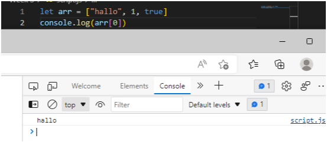

  - Update Array

    <div align="justify">Seperti tipe data dan variabel pada umumnya, kita dapat mengupdate data pada Array

    example:

    &nbsp;&nbsp;&nbsp;&nbsp;&nbsp;&nbsp;&nbsp;&nbsp;&nbsp;
    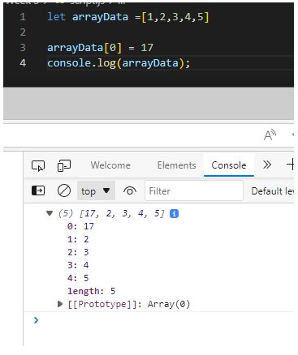

  - Properti array

    Array memiliki 5 properti yang sering digunakan yaitu :

    - constructor
    - length
    - index
    - input
    - prototype

    example:

    &nbsp;&nbsp;&nbsp;&nbsp;&nbsp;&nbsp;&nbsp;&nbsp;&nbsp;
    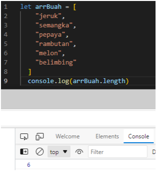

  - Method array

     - .push adalah method untuk menambahkan item array pada urutan yang paling akhir  
    ```
     let sayur = ['bayam', 'wortel', 'sawi'];
     sayur.push('kulbis')
     console.log(sayur) // output:['bayam', 'wortel', 'sawi','kulbis']
    ```
    - .pop adalah method yang menghapus item array index terakhir
    ``` 
     let sayur = ['bayam', 'wortel', 'sawi'];
     sayur.pop()
     console.log(sayur) // output: ['bayam', 'wortel']
    ```
    - .shift adalah method untuk menghapus item array pada index pertama 
    ``` 
     let sayur = ['bayam', 'wortel', 'sawi'];
     sayur.shift()
     console.log(sayur) // output: ['wortel', 'sawi']
    ```
    - .unshift adalah method untuk menambahkan array pada index pertama 
    ``` 
     let sayur = ['bayam', 'wortel', 'sawi'];
     sayur.unshift('tomat')
     console.log(sayur) // output:['tomat','bayam', 'wortel', 'sawi']
     ```

    - .splice adalah method untuk merubah data arraynya dan dapat mereturn nilai
    ``` 
    let arrBuah = [
    "jeruk", 
    "semangka", 
    "pepaya", 
    "rambutan",
    "melon",
    "belimbing"
     ]
     arrBuah.splice(2, 2, "buah naga")
     console.log(arrBuah) // output:['jeruk', 'semangka', 'buah naga', 'melon', 'belimbing']
     ``` 

    - .slice adalah method untuk ambil data dgn cara mengcopy
    ```
    let arrBuah = [
    "jeruk", 
    "semangka", 
    "pepaya", 
    "rambutan",
    "melon",
    "belimbing"
     ]
     arrBuah.splice(2, 2, "buah naga")
     console.log(arrBuah) // output:['jeruk', 'semangka', 'pepaya', 'rambutan', 'melon', 'belimbing']
     ``` 

  - Looping data

    untuk melakukan looping pada array ada .map dan .forEach
    - .forEach adalah method untuk melakukan looping pada setiap elemen array 
    example:

    &nbsp;&nbsp;&nbsp;&nbsp;&nbsp;&nbsp;&nbsp;&nbsp;&nbsp;
    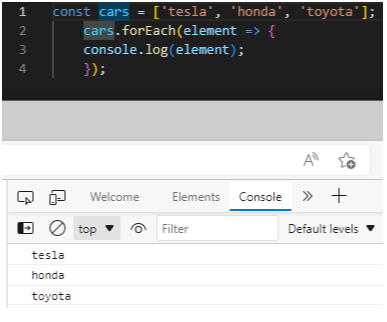

    - .map adalah method untuk melakukan perulangan dengan membuat array baru
    example:
    
    &nbsp;&nbsp;&nbsp;&nbsp;&nbsp;&nbsp;&nbsp;&nbsp;&nbsp;
    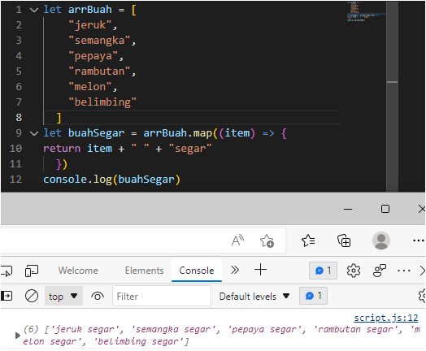

- ## Multidimensional array 

  <div align="justify">Bisa dianalogikan sebagai array of array. 

   - Multidimensional array sama seperti matriks yaitu memiliki 2 dimensi (x,y)

     ```
     let inventory = [
        ['Kaos Polos' , 10],
        ['Jaket' , 5],
        ['Topi' , 12],
        ['Celana' , 4],
     ];
     console.log(inventory);
     ```
  - Mengakses multidimensional array
     ```
    let inventory = [
        ['Kaos Polos' , 10],
        ['Jaket' , 5],
        ['Topi' , 12],
        ['Celana' , 4],
    ];
    console.log(inventory[1][0]);
    ```
- ## Javascript Object

  <div align="justify">object adalah sebuah tipe data pada variabel yang menyimpan properti dan fungsi (method). 

  <div align="justify">Properti adalah data lengkap dari sebuah object. Method adalah action dari sebuah object. Apa saja yang dapat dilakukan dari suatu object.

  - Membuat dan mengakses objek
    
    &nbsp;&nbsp;&nbsp;&nbsp;&nbsp;&nbsp;&nbsp;&nbsp;&nbsp;
    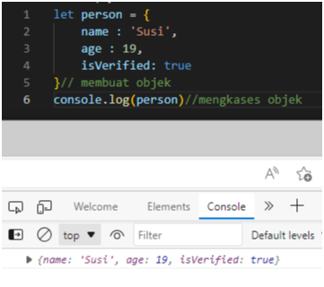

    Saat pemanggilan properti object dapat menggunakan bracket notation
    ```
    let person = {
        name : 'Susi',
        age : 19,
        'current address': 'Salatiga'
    }
    console.log(person['name'])
    ```

  - Menambah properti baru

    &nbsp;&nbsp;&nbsp;&nbsp;&nbsp;&nbsp;&nbsp;&nbsp;&nbsp;
    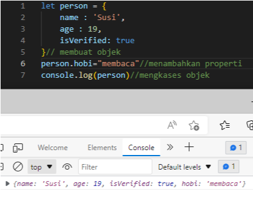

  - Mengganti nilai properti

    &nbsp;&nbsp;&nbsp;&nbsp;&nbsp;&nbsp;&nbsp;&nbsp;&nbsp;
    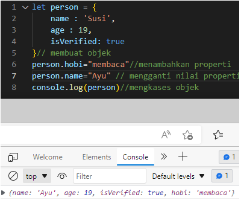

  - Delete object

    &nbsp;&nbsp;&nbsp;&nbsp;&nbsp;&nbsp;&nbsp;&nbsp;&nbsp;
    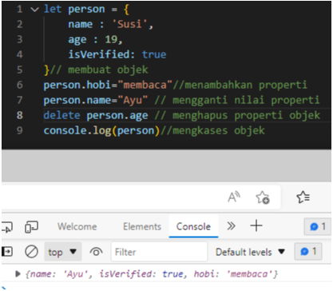

  - Method Object

    jika value yang dimasukkan pada properti berupa function.

    &nbsp;&nbsp;&nbsp;&nbsp;&nbsp;&nbsp;&nbsp;&nbsp;&nbsp;
    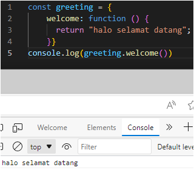

  - Nested Object

     &nbsp;&nbsp;&nbsp;&nbsp;&nbsp;&nbsp;&nbsp;&nbsp;&nbsp;
    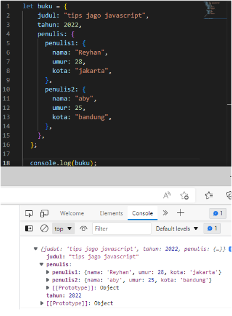

  - Loop object

    &nbsp;&nbsp;&nbsp;&nbsp;&nbsp;&nbsp;&nbsp;&nbsp;&nbsp;
    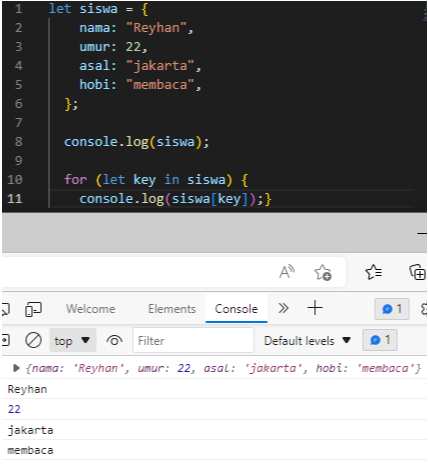

  - Array of object

    Membuat object di dalam array.

    &nbsp;&nbsp;&nbsp;&nbsp;&nbsp;&nbsp;&nbsp;&nbsp;&nbsp;
    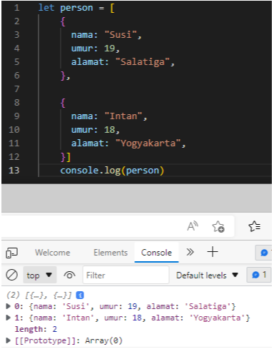

## JavaScript Recursive
- Recursive adalah fungsi yang memanggil dirinya sendiri sampai suatu kondisi tertentu terpenuhi
- A new paradigm :
  - Procedural
  - Conditional
  - Looping
  - Modular (function)
  - Recursive
- Ciri dari recursive:
  - Fungsi recursive memiliki kondisi yang menyatakan kapan fungsi tersebut berhenti. 
  - fungsi recursive selalu memaanggil dirinya sendiri sambil mengurangi atau memecahkan data masukan setiap panggilannya.
- Contoh mencari nilai pangkat 
    ```
    function pow(x,n) {
        if (n=1){
            return x;
        } else {
            return x * pow(x, n-1);
        }
    }
    console.log(pow(3,3)) // 9
    ```

## JavaScript Modules
   
   adalah cara untuk memisahkan kode ke file yang berbeda.

   - Keuntungan menggunakan modules

     - mudah untuk mengelola kode
     - kode tidak menumpuk di 1 file

  - Contoh 

    - index.html 

    ```
    <!DOCTYPE html>
    <html lang="en">
    <head>
       <meta charset="UTF-8">
       <meta http-equiv="X-UA-Compatible" content="IE=edge">
       <meta name="viewport" content="width=device-width, initial-scale=1.0">
       <title>Document</title>
    
    </head>
    <body>
        <script src="./indonesia.js" type="module"></script>
    </body>
    </html>
    ```

    - indonesia.js 

    ```
    import {apple} from './amerika.js';
    import {smartPhoneJepang} from './jepang.js';

    console.log(smartPhoneJepang);
    console.log(apple);
    ```

    - jepang.js 

    ```
    import {apple} from './amerika.js';
    console.log(apple);

    const smartPhone = ["sony", "samsung", "fujitsu", "LG"]
    let dokumenNegara = "Hello"
    export { dokumenNegara, smartPhone as smartPhoneJepang}
    ```

    - amerika.js 

    ```
    let apple = ["iphone", "macbook", "imac"]
    export {apple}
    ```

    - Output

    &nbsp;&nbsp;&nbsp;&nbsp;&nbsp;&nbsp;&nbsp;&nbsp;&nbsp;
    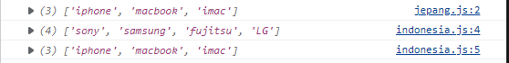


## JavaScript Asynchronus Callback

* JavaScript adalah bahasa pemrograman yang bersifat single-thread  dan asynchronus
* Asyncrhronus mengizinkan komputer memproses task yang lain sambil menunggu proses yang masih berlangsung (Proses dapat diselak proses selanjutnya).
* callback function adalah function yang kita letakkan di dalam argumen/parameter pada function tersebut akan dieksekusi setelah function pertama menyelesaikan tugasnya. 

        ```
        const mainFunc = (number1,number2,callBack) => {
            console.log(number1 + number2)
            callBAck()
        }

        const myCallback =() =>{
            console.log (`Done !')
        }

        mainCallback =() =>{
            console.log (`Done !`)
        }

        main(1,2,myCallback) // output 3 Done!
        ```
        - contoh syncronous dijalankan sesuai urutan code.

        ```
        function p1(){
            console.log(`p1 selesai dijalankan`)
        };
        function p2(){
            console.log(`p2 selesai dijalankan`)
        };
        function p3(){
            console.log(`p3 selesai dijalankan`)
        };

        p1();
        p2();
        p3();

        <!-- Output :
        p1 selesai dijalankan
        p2 selesai dijalankan
        p3 selesai dijalankan -->
        ```

* SetTimeout digunakan untuk simulasi asynchronus. karena sebenarnya kita tidak bisa membuat proses asynchronoud murni. SetTimeout untuk menunda waktu.

         ```
        const p1 = ()=>{
            console.log(`p1 selesai dijalankan`)
        };
        const p2 ()=>{
            setTimeout(() => {
            console.log(`p2 selesai dijalankan`)
            },3000)
        };

        const p3(){
            p1()
            p2()
            console.log(`p3 selesai dijalankan`)
        };
       
        p3();
        ```

* Contoh asynchronus sederhana :
    ```
    console.log("A")

    // butuh proses yg memakan waktu
    // callback -> function yg dijadikan sbg argumen
    setTimeout(() => {
    console.log("B")
    }, 1000) // 1000 mili second (1 detik)

    console.log("C")

    <!-- output :
    A
    C
    B
    Note : Muncul C terlebih dahulu karena B diberi setTimeout -->
    ```
## JavaScript Asynchronus Promise

  * Promise adalah salah satu fitur baru di ES6, biasa digunakan untuk melakukan http request/fetch data dari API.  
  * Dalam pengambilan data, promise memiliki 3 kemungkinan state.

    1. Pending (sedang dalam proses)
    2. Fulfilled (berhasil)
    3. Rejected (gagal)
  
   Example :

   ```
     let nontonPromise = new promise((resolve, reject) => ()){
        setTimeout(() => {
            resolve("nonton terpenuhi")
        }, 2000)
     })

     // Dibawah ini untuk mengekseskusi promise

     console.log("A");

     nontonPromise.then(result => {
        console.log(result)
     })

     console.log("C");

     <!-- Output :
     A
     C
     nonton terpenuhi -->

   ```
## Javascript web storage

* Dengan adanya web storage kita bisa menyimpan data kita secaran lokal di browser user
* Cookie, tempat menyimoan data seebelum adanya web storage.
web API digunakan untuk menghubungkan js dengan browser agar daling terkoneksi.
* Web storage dapat menyimpan : referensi user, setting, score, dan posisi video.
* web storage ada dua yaitu :
    - local storage, jika halaman ditutup data tidak hilang.
    - session storage, jika halaman ditutup data akan hilang.
* Jangan diguanakan untuk : Data sensitif, Otentikasi
* contoh penerapan dengan membuat todo list :
siapkan file html berikut.

  &nbsp;&nbsp;&nbsp;&nbsp;&nbsp;&nbsp;&nbsp;&nbsp;&nbsp;
    

* Diatas akan dibuatkan form yang isinya diinputkan dapat ditampilkan dibawah makan.

berikut file js nya :

```
// ==================== init penampung list dari todo
const todos = [];

// ==================== check ketika pertama kali website di buka, apakah ada key: theme dan value: dark di storage
if (localStorage.getItem("todo")) {
  const todoStore = JSON.parse(localStorage.getItem("todo"));

  todoStore.map((todo) => {
    const li = document.createElement("li");
    li.innerText = todo;

    const container = document.querySelector("#list-container");
    return container.appendChild(li);
  });
}

// ==================== check ketika pertama kali website di buka, apakah ada key: theme dan value: dark di storage
document.querySelector("form").addEventListener("submit", (ev) => {
  ev.preventDefault();
  const userInput = document.querySelector("input").value;

  const li = document.createElement("li");
  li.innerText = userInput;

  todos.push(userInput);

  localStorage.setItem("todo", JSON.stringify(todos));

  const container = document.querySelector("#list-container");
  container.appendChild(li);
});

/* 
  Conclucion:
  JSON.parse -> ubah string ke object 
  JSON.stringify -> ubah apapun ke string JSON
*/
```

* untuk menyimpan gunakan localStorage.setitem
    

       


    
    


    

    


   


