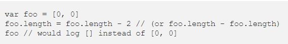
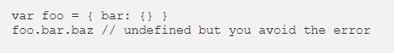

### WRITING AND PRESENTATION WEEK 02

## DAY 06
# JS Dasar - Scope & Function

**Scope**

* Scope adalah konsep dalam flow data variabel. Menentukan suatu variabel bisa diakses pada scobe tertentu atau tidak.
* Blocks adalah code yang berada didalam curly braces {}.
* Conditional, function dan loong menggunakan blocks.
* Global scope berarti variabel yang kita buat dapat diakses dimanapun dalam suatu file.
* Agar menjadi global scope, sesuatu variabel harus dideklarasikan diluar Blocks.
* Contoh variabel yang dideklarasikan secara global scope :


* Local scope, berarti kita mendeklarasikan variabel didalam block seperti function, conditional, dan looping. Contoh variabel yang dideklarasikan secara local scope :


**Function**

* Function adalah sebuah blok kode dalam sebuah grup untuk menyelesaikan 1 task/1 fitur.
* Sintaks penulisannya :

1. Function classic

```
    function myFunction (kondisi){
        statement
    }
```

2. Function Variabel

```
let myFunction = Function(){

}
```

3. Arrow Functiion

```
let myFunction = () => {

}
```

* **Memanggil Function**

```
greeting()
console.log(greeting()); 
```

**Parameter dan Argumen**

* Dengan parameter, function dapat menerima sebuah inputan data dan menggunakan untuk melakukan task/tugas.
* Contoh parameter :


* Argumen adalah nilai yang digunakan saat memanggil function.
* Jumlah argumen harus sama dengan jumlah parameternya.
* Contoh argumen :


* **Default parameters** digunakan untuk memberikan nilai awal/default pada parameter function.
* Default parameters bisa digunakan jika kita ingin menjaga function agar tidak error saat dipanggil tanpa argumen.
* Contoh :


* **Function Helper**, menggunakan function yang sudah dibuat pada function lain.


* **Arrow Function**, cara lain menuliskn function. merupakan fitur terbaru pada ES6 (Javascript version)


* **short syntax Function**


* **javacript error & bug**

* Contoh error


* Didalam warna hijau adalah pesan kesalahan secara keseluruhan.
* Biru muda untuk mencatat apakah kesalahan ditangani dengan benar.
* Kecoklatan (kuning tua) adalah jenis kesalahan.
* Merah adalah tumpukan panggilan.

* **Types of error messages**

* Reference errors (Kesalahan referensi)
    Kesalahan ini terjadi ketika mencoba menggunakan variabel yang belum dideklarasikan. Contoh :

    

* Syntax errors
    Kesalahan terjadi ketika mencoba mengurai objek yang tidak valid.

    

    Penyelesaiannya hanya dengan memperbaiki sintaks.

    

* Range errors

    Objek dengan panjang tertentu dan diberikan panjang yang tidak valid dan kesalahan akan muncul. Misal Array tidak memiliki panjang negatif. Contoh :

    

    Penyelesaian :

    

* Type errors (Kesalahan ketik)

    Kesalahan muncul ketika jenis (angka, string dan sebagainya) yang coba digunakan atau akses tidak kompatibel, seperti mengakses properti dalam jenis variabel yang tidak ditentukan.

    Penyelesaiannya pastikan bilah itu sebelum mencoba mengaksesnya, baik dengan membuat bilah atau dengan memriksa tidak terdefinisi. Contoh-contoh kesalahan :

    

    

    

* **Debugging**

* Untuk men-debug kode JS cara termudah dan umum dengan console.log() variabel yang ingin diperiksa, atau menggunakan chrome, tekan **cmd+o** di macOS atau **ctrl+o** di windows. Maka akan dapat melihat apa yang telah terjadi sebelum titik itu dan dapat mencoba dan mengevaluasi baris berikutnya untuk memeriksa apakah menghasilkan apa yang diharapkan.


## DAY 07
# JS Dasar - Data Type Built in prototype & Method

* Dynamic and weak typing (Pengetikan dinamis dan lemah)
* JavaScript adalah bahasa dinamis dengan tipe dinamis. Variabel dalam JavaScript tidak secara langsung terkait dengan jenis nilai tertentu, dan variabel apa pun dapat diberi (dan ditetapkan ulang) nilai dari semua jenis:

```
let foo = 42; // foo is now a number
foo = "bar"; // foo is now a string
foo = true; // foo is now a boolean
```

* Javascript types (Jenis Javascript), Himpunan tipe dalam bahasa javasript terdiri dari nilai dan objek primitif.
    * Primitive values
    Tipe data sederhana yang hanya memiliki sebuah value  dan tidak memiliki property maupu method.
    - Boolean Type
        Boolean mewakili entitas logis dan dapat memiliki dua nilai : benar dan salah.
    - Null Type
        Null memiliki tepat satu nilai : null.
    - Undefined type
        Variabel yang belum diberi nilai memiliki nilai yang tidak ditentukan.
    - Number Type
        Number adalah objek pembungkus primitif yang digunakan untuk mewakili dan memanipulasi angka seperti 37 atau -9,25.
    - BigInt Type
        Tipe BigInt adalah primitif numerik dalam JavaScript yang dapat mewakili bilangan bulat dengan presisi arbitrer. 
        BigInt dibuat dengan menambahkan n ke akhir bilangan bulat atau dengan memanggil konstruktor.
        Contoh ini menunjukkan, di mana penambahan Number.MAX_SAFE_INTEGER mengembalikan hasil yang diharapkan: 

        ```
            // BigInt
            const x = BigInt(Number.MAX_SAFE_INTEGER); // 9007199254740991n
            x + 1n === x + 2n; // false because 9007199254740992n and 9007199254740993n are unequal

            // Number
            Number.MAX_SAFE_INTEGER + 1 === Number.MAX_SAFE_INTEGER + 2; // true because both are 9007199254740992
        ```

        Dapat menggunakan operator +, *, -, **, dan % dengan BigInts—seperti halnya dengan Numbers. BigInt tidak sepenuhnya sama dengan Angka, tetapi secara longgar begitu.
        BigInt berperilaku seperti Angka jika dikonversi ke boolean: if, ||, &&, Boolean, !.
        BigInts tidak dapat dioperasikan secara bergantian dengan Numbers. Sebaliknya TypeError akan dilemparkan.
    - String Type
        JavaScript digunakan untuk mewakili data tekstual.String JavaScript tidak dapat diubah. Ini berarti bahwa setelah string dibuat, tidak mungkin untuk mengubahnya.
    - Symbol Type
        Simbol adalah nilai primitif yang unik dan tidak dapat diubah dan dapat digunakan sebagai kunci dari properti Objek (lihat di bawah). Dalam beberapa bahasa pemrograman, Simbol disebut "atom".
    * Object (collections of properties/koleksi properti)
        Dalam ilmu komputer, objek adalah nilai dalam memori yang mungkin dirujuk oleh pengenal.
    - Properti
        Dalam JavaScript, objek dapat dilihat sebagai kumpulan properti. Dengan sintaks literal objek, sekumpulan properti terbatas diinisialisasi; maka properti dapat ditambahkan dan dihapus. Nilai properti dapat berupa nilai jenis apa pun, termasuk objek lain, yang memungkinkan membangun struktur data yang kompleks. Properti diidentifikasi menggunakan nilai kunci. Nilai kunci adalah nilai String atau nilai Simbol.
        Ada dua jenis properti objek: properti data dan properti pengakses.
        **properti data**
        Properti data mengaitkan kunci dengan nilai. Hal ini dapat dijelaskan dengan atribut berikut:
        - nilai
        Nilai yang diambil oleh akses get properti. Dapat berupa nilai JavaScript apa pun.
        - dapat ditulis
        Nilai boolean yang menunjukkan apakah properti dapat diubah dengan penugasan.
        - terhitung
        Nilai boolean yang menunjukkan jika properti dapat dihitung oleh for...in loop. Lihat juga Enumerabilitas dan kepemilikan properti untuk mengetahui bagaimana enumerabilitas berinteraksi dengan fungsi dan sintaks lainnya.
        - dapat dikonfigurasi
        Nilai boolean yang menunjukkan apakah properti dapat dihapus, dapat diubah menjadi properti pengakses, dan dapat mengubah atributnya.

        **Properti pengakses**
        Mengaitkan kunci dengan salah satu dari dua fungsi pengakses (dapatkan dan setel) untuk mengambil atau menyimpan nilai.
        Properti accessor memiliki atribut berikut:
        - Dapatkan
        Fungsi yang dipanggil dengan daftar argumen kosong untuk mengambil nilai properti setiap kali akses get ke nilai dilakukan. Lihat juga getter. Mungkin tidak terdefinisi.

        - mengatur
        Fungsi yang dipanggil dengan argumen yang berisi nilai yang ditetapkan. Dieksekusi setiap kali properti tertentu dicoba untuk diubah. Lihat juga setter. Mungkin tidak terdefinisi.

        - terhitung
        Nilai boolean yang menunjukkan jika properti dapat dihitung oleh for...in loop. Lihat juga Enumerabilitas dan kepemilikan properti untuk mengetahui bagaimana enumerabilitas berinteraksi dengan fungsi dan sintaks lainnya.

        - dapat dikonfigurasi
        Nilai boolean yang menunjukkan apakah properti dapat dihapus, dapat diubah menjadi properti data, dan dapat mengubah atributnya.


## Day 08
# JS Dasar - DOM (Introduction), Selecting Elements, DOM (Traversing Elements)

* DOM adalah jembatan supaya bahasa pemrograman dapat berinteraksi dengan dokumen HTML. dengan DOM JS dapat memanipulasi HTML.
* DOM bukan bagian dari javascript, melainkan browser (web API).
*  Hasil ketika mengakses DOM yaitu element dan node.
* **Element**
    - contoh element 
    `<h1>Hallo</p>`
``` 
    <ul>
        <li>satu</li>
        <li>dua</li>
    </ul>
```
* **node**, Bagian terkecil dari HTML. misal text, comment, `<span>`.

* Traversing (menelusuri / menjelajahi elemen) dibagi menjadi 3 yaitu :
    - ke bawah:
        1. getElementByID, dengan menggunakan ini kita bisa mendapatkan suatu element. contoh penerapan :
        * file HTML
       
        `<h1 id="title">Hallo</h1>`
        * file JS

        ```
        let title = document.getElementById("title")

        console.log(title)
        ```

        * Output console

        `<h1 id="title">Hallo</h1>`

        2. getElementsByClassName
        Contoh penerapan :
        * file HTML

        ```
            <ul class="list">
                <li class="item">satu</li>
                <li class="item">dua</li>
            </ul>
        ```

        * file JS

        ```
        let list = document.getElementsByClassName("list")
        // yang menggunakan class name tidak hanya satu element tapi banyak element.
        console.log(list) //Class list
        console.log(list[0]) //untuk akses HTML collection dengan array
        ```
        * Output console
        Jika yang diconsole log hanya class list maka akan tampil
        `HTMLCollection[ul.list]`.
        Cara akses HTML collection ini sama dengan array. ul ada di indeks 0 maka akses dengan `console.log(list[0])` maka akan menghasilkan output `<ul class="list">`.

        3. getElementsByTagName, untuk mencari element berdasarkan tag (`<h1>, <ul>, <li>`).

        4. querySelector family
        contoh penggunaan:
        ```
        let listQuery = doument.querySelector(".list") // hampir sama dengan css selector
        console.log(listQuery) // jika kita menggunakan query selector akan mendapatkan element
        ```
        output console :

        ```
        <ul class="list">_</ul>
        ```

        5. children
        ```
         let list = document.getElementsByClassName("list")

         console.log(list[0].children)
         // kita ingin mendapatkan anak dari ul di indeks ke 0
         ```

    - ke atas : (akses parent)
        1. parentElement
        ```
        let listQuery = doument.querySelector(".list") 

        console.log(listQuery.parentElement)
        ```
        2. closest()
        ```
        let listQuery = doument.querySelector(".list") 

        console.log(listQuery.closest(".list"))
        ```

    - ke samping :
        1. nextElementSibling
        ```
        let listQuery = doument.querySelector(".list") 

        console.log(listQuery.nextElementSibling)
        ```
        2. previousElementSibling
        ```
        let listQuery = doument.querySelector(".list") 

        console.log(listQuery.previousElementSibling)
        ```

* **HTML collection** Mirip seperti array. Untuk mengakses menggunakan indeks dimulai dari 0. HTML collection memiliki proprties dan method. properti yang dapat digunakan yaitu length untuk mengetahui panjang HTML collection, item() pengganti kurung kotak array, dan nameitem() dengan mencantumkan id nya.


## Day 09
# JS Dasar - DOM (Manipulating Elements & Manipulating Styles)

**Manipulating Elements**

* createElement() – membuat elemen baru.
`let element = document.createElement(htmlTag);`

* appendChild()  – menambahkan simpul ke daftar simpul anak dari simpul induk yang ditentukan.

* textContent – dapatkan dan atur konten teks dari sebuah simpul.
* innerHTML – dapatkan dan atur konten HTML suatu elemen.
* innerHTML vs. createElement – jelaskan perbedaan antara innerHTML dan createElement dalam hal membuat elemen baru.
* DocumentFragment – pelajari cara membuat simpul DOM dan menyisipkannya ke dalam pohon DOM yang aktif.
* after() – menyisipkan simpul setelah elemen.
* append() – menyisipkan simpul setelah simpul anak terakhir dari simpul induk.
* prepend() – menyisipkan simpul sebelum simpul anak pertama dari simpul induk.
* insertAdjacentHTML() – mengurai teks sebagai HTML dan menyisipkan simpul yang dihasilkan ke dalam dokumen pada posisi tertentu.
* replaceChild() – mengganti elemen anak dengan elemen baru.
* cloneNode() – mengkloning elemen dan semua turunannya.
* removeChild() – menghapus elemen anak dari sebuah simpul.
* insertBefore() – menyisipkan simpul baru sebelum simpul yang ada sebagai simpul anak dari simpul induk yang ditentukan.
* insertAfter() helper function – menyisipkan simpul baru setelah simpul yang ada sebagai simpul anak dari simpul induk yang ditentukan.

**Manipulating Styles**

* style property – dapatkan atau atur gaya sebaris dari suatu elemen.
* getComputedStyle() – mengembalikan gaya elemen yang dihitung.
* className property – mengembalikan daftar kelas CSS yang dipisahkan oleh spasi.
* classList property – memanipulasi kelas CSS dari suatu elemen.
* Element’s width & height – dapatkan lebar dan tinggi elemen.

## Day 10
# JS Dasar - DOM (Event & Forms)

**Event**

* JavaScript events - memperkenalkan Anda pada peristiwa JavaScript, model peristiwa, dan cara menangani peristiwa.
* Handling events - menunjukkan kepada Anda tiga cara untuk menangani acara di JavaScript.
* Page Load Events - pelajari tentang acara pemuatan dan pembongkaran halaman.
* load event - Memandu Anda melalui langkah-langkah penanganan event load yang berasal dari dokumen, gambar, dan elemen skrip.
* DOMContentLoaded - Pelajari cara menggunakan acara DOMContentLoaded dengan benar.
* beforeunload event  - memandu Anda tentang cara menampilkan dialog konfirmasi sebelum pengguna meninggalkan halaman.
* unload event - menunjukkan cara menangani event unload yang terpicu saat halaman benar-benar dibongkar.
* Mouse events - cara menangani acara mouse.
* Keyboard events - cara menangani acara gulir secara efektif.
* scrollIntoView – pelajari cara menggulir elemen ke tampilan.
* Focus event – mencakup acara fokus.
* haschange event – ​​pelajari cara menangani event ketika hash URL berubah.
* Event Delegation – adalah teknik memanfaatkan penggelembungan acara untuk menangani acara di tingkat yang lebih tinggi di DOM daripada elemen tempat acara berasal.
* dispatchEvent – ​​pelajari cara membuat event dari kode dan memicunya.
* Custom Events – tentukan acara JavaScript khusus dan lampirkan ke elemen.
* MutationObserver – memantau perubahan DOM dan memanggil panggilan balik saat perubahan terjadi.

**Forms**

* JavaScript Form – pelajari cara menangani acara pengiriman formulir dan melakukan validasi sederhana untuk formulir web.
8 Radio Button – menunjukkan cara menulis JavaScript untuk tombol radio.
* Checkbox – memandu Anda tentang cara memanipulasi kotak centang di JavaScript.
* Select box – pelajari cara menangani kotak pilih dan opsinya di JavaScript.
* Add / Remove Options – bagaimana Anda cara menambahkan opsi secara dinamis dan menghapus opsi dari kotak pilih .show you how to dynamically add options to and remove options from a select box.
* Removing Items from `<select>` element conditionally – menunjukkan kepada Anda cara menghapus item dari elemen `<select>` secara kondisional.
* Handling change event – lpelajari cara menangani peristiwa perubahan teks input, tombol radio, kotak centang, dan elemen pilih.
* Handling input event – menangani kejadian input ketika nilai elemen input berubah.