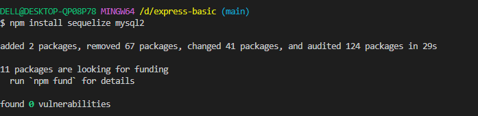
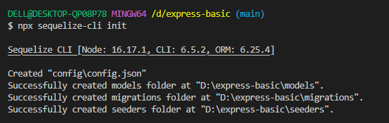
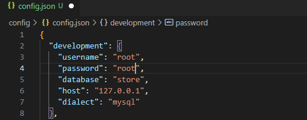

# Writing And Presentation Test Week 06
## Backend Bootcamp

### Database MySQL Basic - Day 06
* Database adalah kumpulan informasi yang disimpan didalam komputer secara sistematik dan saling berelasi.
* Untuk membuat database diperlukan sebuah software yang di namakan dengan DBMS (Database Management System).
* DBMS adalah software yang dapat digunakan oleh user untuk berkomunikasi dengan data yang ada dalam media penyimpanan.
* Tipe utama pada Database management system antara lain, Hierarchical, Network, Relationam, Non Relational, dan object oriented.
* Istilah pada Database :
    - table adalah kumpulan value yang dibangun oleh baris dalam kolom yang didalamnya berisikan atribut dari sebuah data.
    - field adalah kolom dari sebuah tabel dimana masing-masing field memiliki tipe data masing-masing.
    - record merupakan kumpulan nilai yang salin terkait. record merupakan isi dari sebuat tabel.
    - SQL (Structured Query Language) merupakan suatu bahasa yang digunakan untuk mengakses database.
    - SQL adalah query yang digunakan untuk melakukan intersi di RDBMS (Relational Database Management System).

        -> membuat, menampilkan dan menghapus data didalam database

        -> mengatur "permission" (siapa saja yang bisa mengakses data)

        -> membuat dan menghapus database
    - DDL (Data Definition Language) merupakan kumpulan perintah SQL yang digunakan untuk membuat, mengubah dan menghapus struktur dan definisi metadata dari objek-objek database.

        -> Alter digunakan untuk mengubah struktur data, seperti untuk menambahkan atau menghapus kolom/field. Membuat atau menghapus key, mengubah jenis kolom/field yang ada, juga mengubah kolom atau nama tabel.

        -> perintah DROP digunakan untuk menghapus database table, dan view atau index.
    - DML (Data Manipulation Language)

        -> select, digunakan untuk menyeleksi data berdasarkan syarat yang diberikan. Dengan menggunakan perintah select record dalam tabel berjumlah ribuan bahkan jutaan dapat ditampilkan.

        -> insert digunakan untuk memasukkan ke kolom-kolom yang terdapat pada tabel/view.

        -> Where, And, Or, Not, Like

        -> update digunakan untuk melakukan editing pada isi dari kolom (field) yang dipilih. ini dilakukan untuk memperbaiki data lama/terjadi kesalahan.

        -> delete digunakan untuk menghapus data dalam tabel yang menjadi target
    - DCL (Data Control Language)

        -> GRANT digunakan untuk memberikan hak akses pada user.

        -> REVOKE digunakan untuk mencabut hak akses yang telah diberikan pada user.
    - database relationship adalah relasi atau hubungan antarea beberaa tabel dalam bahasa yang kta miliki.
    - relasi antar tabel dihubungkan oleh **primary key** dan **foreign key**.
    - primary key adalah atribut yang tidak hanya mengidentifikasi sevara untuk suatu kejadian, tapi juga mewakili setiap kejadian suatu entitas. Contoh : NIM dalam tabel mahasiswa.
    - foreign key adalah atribut yang melengkapi relationship dan menunjukkan hubungan antara tabel induk dan tabel anak.
    - beberapa tipe database relationship :

        -> many to many relationships

        -> one to many and many to one relationships, paling sering digunakan. contohnya pada e-commerce website.

        -> many to many relationships.

        -> self referencing relationship

    - SQL tabel join, **join** adalah penggabungan tabel yang dilakukan melalui kolom/key tertentu yang memiliki nilai terkait untuk mendapatkan satu set data dengan informasi lengkap.

        -> inner join : menampilkan data hanya yang sesuai di kedua tabel

        -> left join : menampilkan semua data sebelah kiri dari tabel yang di jinkan dan menampilkan data sebelah kanan yang cocok dengan kondisi join. jika tidak cocok maka akan di set NULL secara otomatis

        -> right join : menampilkan semua data sebelah kanan dari tabel yang dijoinkan dan menampilkan data sebelah kiri yang cocok dengan kondisi join. jika tidak cocok maka akan di set NULL secara otomatis

* NoSQL, database NoSQL adalah database yang tidak memiliki perintah SQL.
* konsep penyimpanan semi struktural atau tidak struktural dan tidak harus memiliki relasi layaknya tabel-tabel MySQL.
* Tujuan dari penggunaan database NoSQL untuk model data spesifik dan memiliki skema fleksibel dlaam mengembangkan aplikasi modern. contoh aplikasi berdifat realtime
* kelebihan NoSQL dengan Relational database :

    - NoSQL bisa menampung data yang terstruktur, semi terstruktur dan tidak terstruktur.

    - Menggunakan OOP dalam pengaksesan/manipulasi data.

    - NoSQL tidak mengenal schema tabel yang kaku.
* Document adalah salah satu dari beberapa model database NoSQL.
* Mendefinisikan database sebagai dokumen artinya penyimpan data dan proses manipulasinya dalam bentuk Objek dokumen.
* Contoh objek dokumen yang sering diterapkan dalam pemrograman adalah format JSON.


### Database MySQL Lanjutan - Day 07
* One to Many, satu baris dalam tabel dapat memiliki beberapa baris di table relasinya
* Many to Many, digunakan ketika kedua tabel yang berelasi dapat memiliki beberapa baris di tabel relasinya
* One to One, sering digunakan, diimplementasikan dengan cara yang sama seperti one to many tetapi dengan kondisi tambahan (foreign key merupakan primary key)
* Database Normalization, Merupakan teknik analisis data yang mengorganisasikan atribut-atribut data dengan cara mengelompokkan sehingga terbentuk entitas yang non-redundant, stabil, dan fleksible
* Tujuan database normalization: 

    - Menghilangkan redundan data pada database.

    - Memudahkan juka ada perubahan struktur table database.

    - Memperkecil pengaruh jika ada perubahan dari struktur table database.

* Super Key,Kumpulan dari satu atau lebih dari satu key yang dapat digunakan untuk mengidentifikasi record secara unik dalam sebuah tabel.
* Super Key adalah superset dari Candidate Key.
* Candidate key, kumpulan satu atau lebih fields/columns yang dapat mengidentifikasi record secara unik dalam tabel.
* Bisa jadi ada beberapa Candidate Keys di dalam satu tabel
Setiap Candidate Key bisa digunakan sebagai Primary Key.
* Candidate Key adalah super key yang tidak mempunyai value yang berulang
* Primary Key, kumpulan satu atau lebih fields/columns dari sebuah tabel yang secara unik mengidentifikasi sebuah record dalam tabel database.
* Valuenya tidak boleh berupa null ataupun duplicate value.
* Hanya boleh salah satu Candidate Key yang bisa menjadi Primary Key.
* Alternate key, key yang bisa digunakan menjadi primary key.
* Pada dasarnya, Key ini merupakan candidate key yang tidak dijadikan  primary key.
* Unique key, Kumpulan dari satu atau lebih fields/columns di sebuah table database yang secara unik mengidentifikasi sebuah record dalam table database tersebut.
* Hampir sama dengan Primary key, namun value dari Unique Key bisa berupa satu buah null value di dalam sebuah table database, dan Unique Key tidak bisa memiliki duplicate values
* foreign key, Field di sebuah table database yang menjadi Primary Key di table database lain.
* Value dari Foreign key bisa menerima multiple null dan duplicate values.
* Join Multiple Tables, Mengambil records dari dua atau lebih table database yang memiliki relationship dan akan di sajikan dalam single result set.

    - INNER JOIN, Semua baris akan diambil dari kedua table yang akan di JOIN, selama columns cocok dengan kondisi yang sudah di tentukan. Memungkinkan baris dari salah satu tabel muncul di hasil jika dan hanya jika kedua tabel memenuhi kondisi yang ditentukan dalam klausa ON.

    - LEFT JOIN, Pada JOIN ini, semua records dari table di sisi kiri JOIN statement akan di pilih. Jika record yang di pilih dari table kiri tidak memiliki record yang cocok pada table JOIN yang kanan, maka record tersebut masih dipilih, dan kolom pada table yang kanan akan bernilai NULL. 

* RIGHT JOIN, Pada JOIN ini, semua records dari table di sisi kiri JOIN statement akan di pilih, bahkan jika table di sebelah kiri tidak memiliki record yang cocok.
    
* Agregate Functions, Mengambil satu nilai setelah melakukan perhitungan pada sekumpulan nilai.

    - MAX, fungsi mengembalikan nilai terbesar dari kolom yang dipilih.

    - MIN, fungsi mengembalikan nilai terkecil dari kolom yang dipilih.

    - SUM, fungsi mengembalikan jumlah total kolom numerik.

    - COUNT, fungsi mengembalikan jumlah baris yang cocok dengan kriteria yang ditentukan.

    - AVG, fungsi mengembalikan nilai rata-rata kolom numerik

    - UNION

        -> Digunakan untuk menggabungkan kumpulan hasil dari dua atau lebih pernyataan SELECT.

        -> Setiap pernyataan SELECT dalam UNION harus memiliki jumlah kolom yang sama

        -> Kolom juga harus memiliki tipe data yang serupa
        
        -> Kolom dalam setiap pernyataan SELECT juga harus dalam urutan yang sama

* GROUP BY, Mengelompokkan baris yang memiliki nilai yang sama ke dalam baris ringkasan. Sering digunakan dengan fungsi agregat untuk mengelompokkan kumpulan hasil dengan satu atau lebih kolom.
* HAVING ditambahkan ke SQL karena kata kunci WHERE tidak dapat digunakan dengan aggregate functions.
* LIKE & Wildcards

- Operator LIKE digunakan dalam klausa WHERE untuk mencari pola tertentu dalam kolom.

- Karakter wildcard digunakan untuk menggantikan satu atau lebih karakter dalam sebuah string.

    -> % Mewakili nol atau lebih karakter. Contoh : %ja% akan cocok dengan belajar, javascript, & jangan

    -> _ Mewakili satu karakter. Contoh : m_ster akan cocok dengan master & mister


### Espress.js Middleware Authentication & Authorization - Day 08

* Authentication adalah proses dimana seorang user (melalui berbagai macam akses fisik berupa komputer dll) mendapatkan hak akses kepada suatu entity.
* Authorization adalah proses penentuan apakah user tersebut diizinkan / ditolak untuk melakukan satu atau beberapa action akses terhadap resources tertentu dalam sistem.
* JSON Web Token adalah sebuah JSON Object yang didefinisikan dalam RFC 7519 sebagai cara aman untuk mewakili sekumpulan informasi antara dua pihak.
* Token terdiri dari Header, Content, dan Signature.
* Passport JS adalah middleware authentication untuk Node.JS. Passport JS sangat fleksibel dan modular.
* Redirect biasanya digunakan untuk melanjutkan setelah authentication request.
* Redirect biasanya dikombinasikan dengan Flash Messages, untuk menampilkan status informasi kepada User.
* 


### Build web services and RESTful API Express & sequelize - Day 09


* Sequelize adalah ORM (Object Relational Mapping) Node JS yang berbasis promise. Sequelize mendukung sebagian besar relational Database seperti MySQL, PostgresQL, MariaDB, SQLite dan Miscrosoft SQL Server.
* Dengan fitur fitur di Sequelize, kita bisa mengelola dan mengatur data di database kita dengan cepat, dan efisien
* ORM adalah suatu metode/teknik pemrograman yang digunakan untuk mengkonversi data dari lingkungan bahasa pemrograman berorientasi objek (OOP) dengan lingkungan database relational.  
* instalasi sequelize



* lakukan sequelize init



* Pada config ubah password dan nama database



* buat table dengan

```
npx sequelize-cli model:generate -- name user --atributes nama:string,email:string
```
