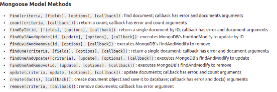

# Writing And Presentation Test Week 07
### Backend Stage

## Build Web Service and RESTful API With Express & Sequelize

* Server -> ORM (sequelize) -> Database 
* Sequelize adalah ORM (Object Relational Mapping) Node JS yang berbasis promise. Sequelize mendukung sebagian besar relational Database seperti MySQL, PostgresQL, MariaDB, SQLite dan Miscrosoft SQL Server
* Jenis sequelize ada dua yaitu migration, dan without migration
* migration adalah history, perubahan pada table
* Instalasi sequelize 
    ```
    npm install sequelize mysql2 (instalasi ini hanya diproject bukan global)
    ```


* untuk menginstall migration
    ```
    npm install -D sequelize-cli
    ```


* menginisialisai model
    ```
    npx sequelize-cli init
    ```


* menambahkan database baru
    ```
    npx sequelize db:create
    ```


* migration -> ubah-ubah table, seeders -> untuk input data
* jangan lupa untuk mengubah nama database dan password pada file config.json
* membuat nama tabel & atribut, file akan tampil pada folder model dan migration. folder model merepresentasikan sesuatu yang ada ditabel. folder migration berisi perintah untuk membuat sesuatu pada database.
    ```
    npx sequelize model : create --nama user --atributes name : string, email : string, password : string
    ```


* untuk tabel dapat dijalankan
    ```
    npx sequelize db:migrate
    ```


* setelah di migrate maka tabel yang sudah dibuat akan muncul pada workbeanch atau tools lainnya


* menghapus table (drop table) pada migration
    ```
    npx sequelize db:migrate:undo
    ```


* setelah table di undo maka akan terhapus


* undo dilakukan pada file migration paling terakhir hingga pertama 
* untuk mengundo semua file yang ada di migrations
    ```
    db:migrate:all
    ```
* untuk mengundo file paling terakhir hingga file yang diinginkan 
    ```
    db:migrate:all --to blablabla.js
    ```
* untuk menabahkan kolom baru pada tabel 
    ```
    npx sequelize db:migration create --name add-coloumn-user
    ```


* dari hasil migration create diatas folder migration akan bertambah satu file yang digunakan untuk menambahkan file
* membuat seeders, ini digunakan untuk mengisikan informasi dari kolom-kolom
    ```
    npx sequelize db:seed --seed 20221112122357-demo-user.js
    ```


* menjalankan server dengan 
    ```
    npm run dev
    ```


* untuk mendapatkan data menggunakan get All user pada file user controller

    ```
    const models = require ('../models')
    const { user } = models;
    ```

    -> pada get All user :

    ```
     getAllUser: async (req, res) => {
      const users = await user.findAll()
      res.json({
        message: "success get data",
        data: users
    ```
* kemudian coba jalankan dengan thunder client maka akan mendapatkan data seperti dibawah ini


* membuat model dan migration untuk relasi, kemudian lakukan db:migrate
    ```
    npx sequelize model:create --name blog --attributes title:string,desc:string,userId:integer
    ```


* membuat seeders untuk mengisi demo data blog
    ```
    npx sequelize seed:create --name demo-blog
    ```

    ```
    npx sequelize db:seed --seed  20221113030821-demo-blog.js
    ```


* menjalankan blog, caranya buat controler dan router untuk blog. ubah setingan pada index roter (menambahkan blog)


## Introduction & Design Database with MongoDB
## Build Web Services and RESTful API with Express & Mongoose

* MongoDB adalah salah satu database source NoSQL yang cukup populer digunakan.
* MongoDB sering dipakai untuk aplikasi berbasis Cloud, Big Data maupun Grid COmputing
* Jika SQL menyimpan data menggunakan relasi tabel, MongoDB menggunakan dokumen dengan format JSON
* NoSQL adalah Not Only SQL
* Artinya kita bisa mengolah database dengan fleksibel dan tidak membutuhkan Query
* Artinya kita bisa mengolah database dengan fleksibel dan tidak membutuhkan Query
* Akhirnya kita memiliki skalabilitas yang tinggi sesuai dengan perkembangan data kita
* Kelebihan MongoDB :

    - Sistem tidak membutuhkan Tabel

    - Tidak perlu menggunakan Tabel yang terstruktur

    - By Default sudah menggunakan JSON(JavaScript Object Notation), sehingga memudahkan integrasi dengan JavaScript

    - Performa lebih cepat dengan kemampuan menampung banyak data yang bervariasi

* Kekurangan MongoDb :

    - Tidak mendukung transaksi

    - Masalah konsistensi data

    - Menggunakan banyak memory
    
    - Hanya bisa menampung maksimal 16MB disetiap document

* Komponen dari database MongoDB : database -> collection -> document
* Database adalah wadah untuk menyimpan berbagai macam Collection
* Collection adalah tempat kumpulan dari berbagai macam document, sehingga collection sering disamakan dengan **tabel** pada SQL
* Document adalah unit terkecil yang berada pada MongoDB
* install mongoDB terlebih dahulu, pastikan sudah ada mongoDB compass. jika belum ada download secara terpisah
* ketikkan pada terminal proyek anda dengan 
```
npm install mongoose
```


* buka mongoose compass. anda bisa menggunakan perintah dengan gui atau cli
* jika menggunakan cli pilih >_MONGOSH pada bagian kiri bawah mongoose commpas
* gunakan use database atau membuat database baru
* kemudian untuk membuat collection gunakan 
```
db.createCollection("nama Collection")
```
* untuk membuat data pada collection gunakan 
```
db.namaCollection.insertOne({nama: "aku",email: "aku@gmail.com})
```
* untuk melihat data yang sudah dimasukkan gunakan
    - untuk melihat seluruh data

    ```
    db.namaCollection.find()
    ```

    - untuk melihat data berdasarkan id

    ```
    db.namaCollection.findById()
    ```

* untuk update data gunakan
```
db.namaCollection.update({'nama': 'saya},{$set:{'nama': 'saya'})
```


* untuk menghapus data gunakan
```
db.namaCollection.remove({'nama': 'saya'})
```


## Build Web Services and RESTful API with Express & Mongoose

- Pengertian Mongoose

  Mongoose adalah library yang bisa dibilang sebagai Object Modelling MongoDB untuk NodeJS.Mongoose bisa digunakan untuk mengelola hubungan antara data, menyediakan validasi.Dan juga digunakan untuk menerjemahkan antara objek dalam kode dan representasi Objek tersebut di MongoDB.

- Install Mongoose
  
  Untuk menggunakan mongoose,kita perlu menginstallnya terlebih dahulu :

  ```bash
  npx install mongoose
  ```

- Create connection 
  Membuat koneksi dengan menggunakan MongoDB database

  

- Defining schema

  kita mendefine Skema, dan tipe data untuk setiap field yang akan digunakan.kita menggunakan model users dari schema yang telah kita buat untuk melakukan pengolahan data, atau operasi CRUD.

  
  

- Membuat CRUD sederhana

  - install express
    
    ```bash
    npx install express
    ```
  
  - Buat endpoint
    
    

  - Buat controller
    
    Kita bisa menggunakan method yang sudah disediakan mngoose untuk mengolah data.

    .

    Method-method di mongoose :
    
    .

- Populate
  
  Populate adalah proses penggabungan 2 collection atau lebih menjadi satu objek JSON.
  
  Contoh penggunaan :

  .

  Pada gambar di atas kita melakukan populate dari schema user.Sehingga pada saat menambahkan todo yang didalamnya terdapat id user,maka web server juga akan memanggil nama pemilik dari id tersebut.

## Intro to container and Docker

- Pengertian Docker

  Docker adalah software yang menjalankan suatu aplikasi menggunakan container. Docker berfungsi sebagai penyedia layanan virtual bagi aplikasi yg diinstall pada sebuah host. 

- Container vs Virtual Machine

  VM memakan banyak resource dan waktu utk booting karena melakukan virtualisasi pada host hardware-nya. 

  Sedangkan container kebalikannya dari vm, container melakukan virtualisasi pada host OS-nya.

- Perintah dasar docker
  
  - docker pull

    Download image dari docker hub

    ```bash
    docker pull chuanwen/cowsay
    ```

  - docker images

     Melihat kumpulan images yang sudah terdownload

    ```bash
    docker images
    ```

  - docker run

    Menjalankan container

    ```bash
    docker run chuanwen/cowsay
    ```

  - docker ps
  
    Melihat container yang berjalan


    ```bash
    docker ps
    ```

